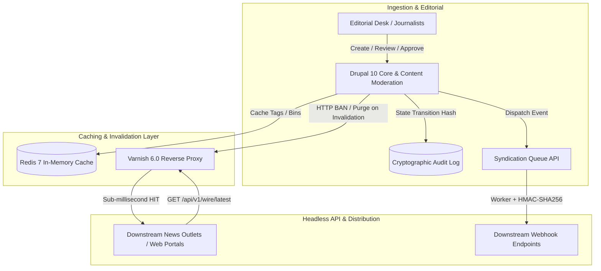

# 🗞️ PAP Newsroom Wire System (Drupal 10 + Varnish + Redis)

> Production-grade, high-throughput editorial newsroom and wire dispatch engine tailored for agency journalism (Polska Agencja Prasowa - PAP), built with **Drupal 10**, **PHP 8.3**, **Varnish 6.0**, and **Redis 7**.

---

## 🏛️ Architecture Overview

The system is designed for high-concurrency, low-latency news publishing where dispatches must be distributed to downstream subscribers, web portals, and terminal clients in sub-millisecond timeframes with zero-trust audit compliance.



---

## 📦 Custom Modules Suite (`web/modules/custom/`)

### 1. `newsroom_wire` (Data Model & Editorial Workflows)
- **Content Type:** `wire_dispatch` with custom fields:
  - `field_lead`: Formatted wire lead text.
  - `field_urgency_level`: Allowed values `FLASH` (highest priority breaking news), `URGENT` (pilne), `ROUTINE` (standardowe).
  - `field_category`: Taxonomy reference to Polish wire categories (*Polityka*, *Gospodarka*, *Świat*, *Sport*, *Bezpieczeństwo*).
  - `field_embargo_until`: ISO-8601 publication embargo timestamp.
  - `field_author_signature`: Journalist signature (e.g. `(PAP) mkr/ agz`).
  - `field_syndication_status`: Status tracker (`pending`, `dispatched`, `failed`).
- **Editorial State Machine:** Content moderation workflow (`draft` → `review` → `approved` → `scheduled` → `published` → `archived`).

### 2. `newsroom_api` (High-Throughput Headless REST API)
- `GET /api/v1/wire/latest`: Paginated, filterable endpoint (`?urgency=FLASH&category=Gospodarka&limit=20`).
- `GET /api/v1/wire/{id}`: Single dispatch endpoint.
- **Edge Cache Headers:** Outputs `Cache-Control: public, max-age=60, s-maxage=3600, stale-while-revalidate=60` and `X-Cache-Tags`.
- **RFC 7807 Problem Details:** Structured error responses (`application/problem+json`) with error taxonomy URIs.

### 3. `newsroom_syndication` (Event-Driven Webhook Dispatcher)
- Implements `WirePublishedEvent` subscriber listening to publication state transitions.
- Asynchronous distribution via Drupal Queue API (`newsroom_syndication_queue`).
- Cryptographic payload signing via `X-PAP-Signature` (HMAC-SHA256) and exponential backoff retry mechanism.

### 4. `newsroom_security` (Tamper-Evident Audit Logging)
- Records every editorial state change and revision modification into `newsroom_audit_log`.
- **Cryptographic Hash Chaining:** Every log entry calculates `SHA-256(id + nid + vid + uid + state + payload_hash + previous_hash)`.
- Verification engine detects any manual SQL record tampering or revision history modifications.

### 5. `newsroom_core` (Edge Integration & Drush Tooling)
- **Varnish Purger:** Intercepts Drupal's `CacheTagsInvalidatorInterface` to issue HTTP `BAN` requests with `X-Cache-Tags` regex to Varnish.
- **Drush CLI Suite:**
  - `drush newsroom:seed` (`drush nr-seed`): Populates realistic Polish news agency wire dispatches.
  - `drush newsroom:verify-audit` (`drush nr-audit`): Verifies cryptographic integrity of all audit chains.
  - `drush newsroom:syndicate` (`drush nr-syndicate`): Processes the asynchronous syndication queue.

---

## 🚀 Quick Start & CLI Guide

### Environment Setup (DDEV)
```bash
# Start containers (Nginx PHP 8.3, MariaDB 11.8, Redis 7, Varnish 6.0)
ddev start

# Seed sample wire dispatches
ddev drush newsroom:seed

# Verify audit chain integrity
ddev drush newsroom:verify-audit

# Process syndication queue
ddev drush newsroom:syndicate
```

### Testing API & Caching
```bash
# 1. Fetch latest wire dispatches (Varnish Cache Hit on 2nd request)
curl -i http://demo-newsroom.ddev.site/api/v1/wire/latest

# 2. Filter by urgency level
curl -i "http://demo-newsroom.ddev.site/api/v1/wire/latest?urgency=FLASH"

# 3. Test single item
curl -i http://demo-newsroom.ddev.site/api/v1/wire/1

# 4. Test RFC 7807 Error Handling (Invalid Parameter)
curl -i "http://demo-newsroom.ddev.site/api/v1/wire/latest?urgency=INVALID"
```
